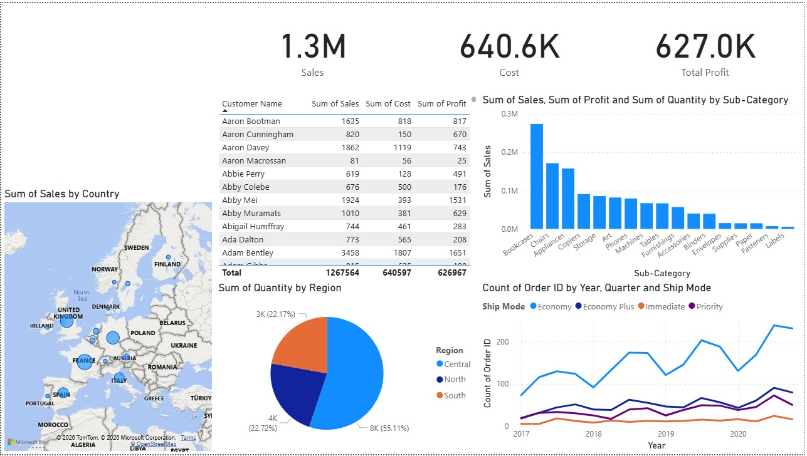

# Retail Operations & Profitability Dashboard

## 📖 Overview

This project transforms 4,000+ raw transactional records from a global retail superstore into an interactive Power BI dashboard that goes beyond simple reporting. The dashboard identifies **profitability leaks** and **high-value customer segments**, enabling store managers and regional directors to make data-driven operational decisions through a self-service interface.

## 🛠 Tech Stack

| Tool | Purpose |
|---|---|
| **Power BI Desktop** | Dashboard development and publishing |
| **Power Query** | ETL, data cleaning and transformation |
| **DAX (Data Analysis Expressions)** | Data modelling and KPI calculations |
| **Microsoft Excel / CSV** | Data source |

## 📂 Dataset

- **Source:** Global Superstore sales log (Excel/CSV)
- **Size:** 4,000+ transactional records
- **Key Fields:** Order Date, Shipping Mode, Customer Segment, Region, Product Category, Sub-Category, Sales, Quantity, Profit

## ❓ Business Problem

A retail chain struggled to identify which regions and product sub-categories were driving actual profit versus just top-line revenue. Simple reports were not enough - the business needed a self-service tool that allowed managers to drill into performance data without relying on analysts for every query.

**Goals:**
- Track real-time KPIs across sales, profit, and quantity
- Identify underperforming product lines and low-margin sub-categories
- Optimise logistics by analysing shipping mode distribution
- Surface high-value customer segments for targeted strategy

## 📊 Dashboard Features

### Executive Scorecard
High-level KPI cards for Total Sales ($2.2M+), Total Profit, and Total Quantity - providing an immediate business health check at a glance.

### Geographic Analysis
Map visualisation identifying sales penetration across states and regions, highlighting high-volume and underserved markets.

### Category Decomposition
Interactive bar and donut charts enabling drill-down from broad categories (e.g. Technology) into specific sub-categories (e.g. Copiers) to pinpoint margin contributors and detractors.

### Logistics Breakdown
Shipping mode distribution analysis (Economy, Economy Plus, Immediate, Priority) to understand fulfilment preferences and cost implications.

### Customer Segmentation
Consumer vs. Corporate performance comparison to support tailored promotional and pricing strategies by segment.

## 📊 Key Findings

| Insight | Finding |
|---|---|
| Total Sales | $2.2M+ across all regions |
| Lowest margin sub-category | Tables (high volume, low profit) |
| Highest volume region | Central region |
| Top performing category | Technology |
| Shipping mode preference | Economy (highest order count) |

## 💡 Business Impact

- **Margin Optimisation:** Identified that Tables sub-category yielded significantly lower profit margins despite high sales volume - flagging a need for inventory strategy and pricing review.
- **Operational Efficiency:** Pinpointed the Central region as a high-volume area, providing data to support localised marketing and supply chain allocation decisions.
- **Customer Strategy:** Isolated Consumer vs. Corporate segment profitability, enabling tailored promotional strategies based on segment performance
